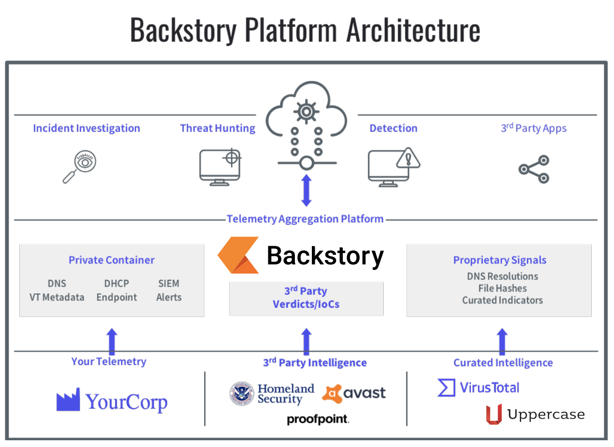

# Security Operations

### Prevent. Detect. Assess. Monitor. Respond.

---

# We must move scale as fast as the business

We need to be infinitely elastic and designed to scale by default: anywhere, any time, in any cloud, on any system.

But, we need more than just the ability to scale. We need to respond in seconds. We need to deploy in days. We need to **operate** immediately.

---

# We still need to maintain economies of scale

We [need to be able to afford](https://www.reddit.com/r/AskNetsec/comments/b32nr1/anyone_successfully_get_pricing_info_on_chronicle/) to keep every bit of security data we generate.

In numerous investigations, access to previous telemetry meant the difference between clear answers and hoping for the best.

We must keep the cost of our response proportionate to the cost of a security incident.

---

# We need to maintain our scale

We must create **leverage**, not just automate. We **must** be 10x.

Our systems **must** be easy to manage and allow us to focus on eliminating **risk**.

---

# Execution

We leave infrastructure up to the experts.

We provide **_contextual relevancy_** to our environment.

---

# We must embrace server-less

We can't afford the time setting up complicated infrastructure.

We need to be able to respond instantly.

# We want to fail fast

No contracts. If we don't like it, we should be able to bail out.

---

# We must design for leverage

We need to look at technologies that provide [lift](https://chronicle.security/products/platform/), allowing us to scale to [all](https://www.limacharlie.io/) devices.

1. **Commercial**: Chronicle Backstory (Former Google X Moonshot) 

2. **Hybrid**: LimaCharlie.io (Founder formerly of Chronicle Backstory)

3. **Open Source**: StreamAlert (AirBnb)

---

# Chronicle Backstory

Chronicle telemetry processing automatically connects related pieces of activity data into a single data structure.

Network packets identified with an IP address connect to email logs with an email address to file transfers from a MAC address.

Chronicle understands how to link these different pieces to a single asset or user.

---

---

---

# Team Processes

We will run D&R rules against historical endpoint telemetry and log files.

We will build Continuous Delivery (CD) / Continuous Integration (CI) into detection systems.

We will use these to gain insight into **risk** inside our environment.

We will quantifiably assess and address which systems present **risk**.

---

# Costs

Backstory: **$45**, per user, per month.

Endpoint Detection and Response: **$2**, per endpoint per month.

Private cloud options available at negotiated prices.

---

# Estimated cost for 3,000 employees annually 

**$1,692,000** without negotiation or volumetric discounts.

Paid for fully in scalable "cloud like" fees. 

Dynamically scale in any direction at the need of the business.

Available globally.

---

# Threat Detection

Chronicle threat detection starts with its Unified Data Model (UDM), a comprehensive and extensible schema for any security relevant telemetry.

Data sent to Chronicle’s UDM is enriched with context (asset, user, threat intelligence, and vulnerabilities) and correlation (IP to host).

A powerful rules engine syntax (YARA-L) enables analysts to build detection rules.

---

# Rules

A library of extensible pre-built rules provide out of the box coverage for numerous malware variants, ransomware, trojans, suspicious behaviour, MITRE ATT&CK techniques, lolbin attacks and more.

We can also take advantage of detection rules and threat indicators from Uppercase, Chronicle’s dedicated threat research team. 

---

---

# Summary

Total yearly cost is **$1,700,000** approx. 
Allows for full historical correlation of threat. 
Serverless, no architecture to maintain. 
Thousands of pre-existing alerts and detection techniques, validated already for false-positives.

# Any questions?

jonathan.haas@
